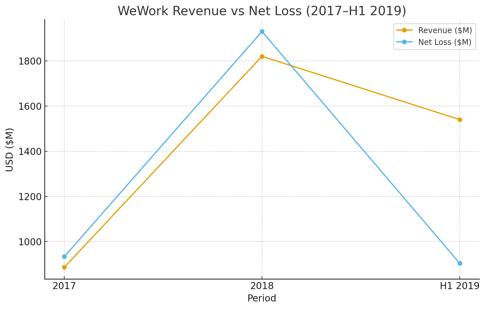
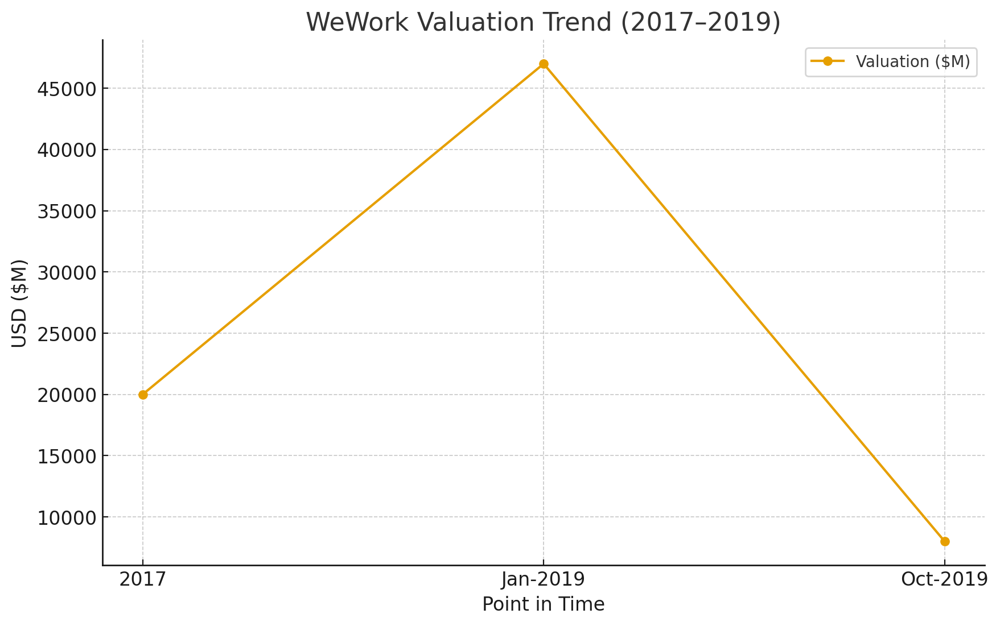

# WeWork IPO Collapse (2019): Root Cause Analysis — Data Notebook

This repository contains a reproducible data analytics notebook that reconstructs key figures, tables, and takeaways from a Root Cause Analysis (RCA) of the WeWork IPO collapse in 2019.

## What’s inside
- `wework_ipo_rca.ipynb` — a Jupyter notebook with:
  - Clean, structured datasets derived from public numbers cited in the RCA
  - Charts that recreate the revenue vs. net loss trend and valuation trend
  - A Failure Mode & Effects Analysis (FMEA) table with computed RPN
  - A timeline of major events
  - Quick KPI calculations (burn rate, simple ratios)
- `requirements.txt` — Python packages to run the notebook
- `LICENSE` — MIT license

## How to run
1. Create and activate a virtual environment (optional but recommended).
2. Install dependencies:
   ```bash
   pip install -r requirements.txt
   ```
3. Launch Jupyter and open the notebook:
   ```bash
   jupyter notebook wework_ipo_rca.ipynb
   ```

## Preview

### Revenue vs Net Loss


### Valuation Trend


## Notes
- Data here is **reconstructed** from the published figures described in the RCA (revenues, net losses, valuation points, lease obligations, etc.). Where the RCA provides half-year figures (H1 2019), we preserve that scope in the dataset rather than imputing a full-year estimate.
- This repo is intended for **educational and analytical** purposes.

## License
MIT


## Repo Structure
```
wework-ipo-rca/
├── wework_ipo_rca.ipynb
├── src/
│   └── helpers.py
├── .github/workflows/ci.yml
├── README.md
├── requirements.txt
├── LICENSE
├── rev_vs_loss.png
├── valuation_trend.png
```